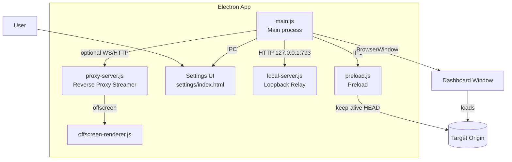
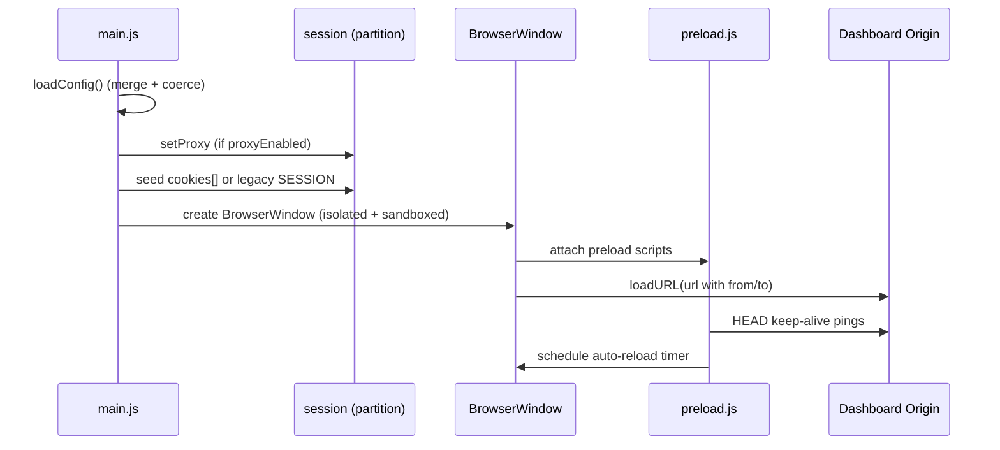
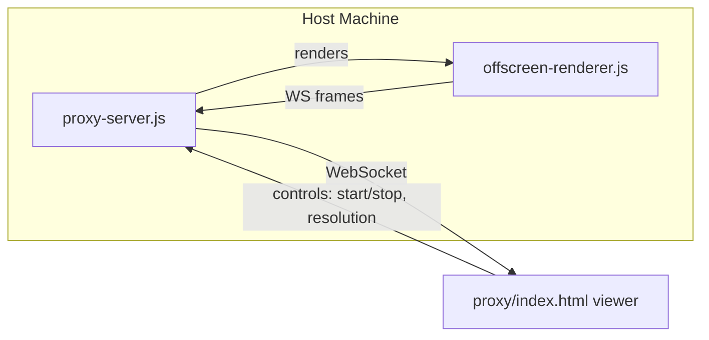

# Architecture

This app runs a secure Electron BrowserWindow that loads a target dashboard and keeps it alive with auto‑reload, optional navigate‑back, and keep‑alive pings. It also exposes optional local and remote relays.

Key properties
- contextIsolation: true, sandbox: true, nodeIntegration: false
- Non‑persistent session partition with cookies seeded before first navigation
- Layered configuration persisted only to userData

## High‑level diagram

## Layered configuration
Order of merge (later wins):
1. resources/config.json (packaged default)
2. repo config.json (root)
3. src/config.json (if present)
4. %APPDATA%/<AppName>/config.json (userData — persisted)

On startup, main.js loads all layers, merges, applies coercions, then writes the merged result to userData. Secrets are stored encrypted (AES‑256‑GCM) as userEnc and twoFAEnc.

## Startup flow

## Auto‑reload and rolling window
- Auto‑reload is active when autoReloadEnabled && reloadAfterSec > 0.
- If toggled ON with invalid/<=0, it coerces to 250s.
- If rolling window is ON, URL query from/to is updated each reload; Settings UI enforces reloadAfterSec < window duration.

## Navigate‑back + child tab timeout
- When navigateBackEnabled and tabTimeoutSec > 0, any navigation away from the target origin is allowed briefly, then redirected back; child windows are closed if stale.

## Reverse Proxy streamer (remote)

## Security boundaries
- Cookies and auth stay on the host machine; the reverse‑proxy viewer is WS‑only and can be gated behind a network boundary.
- Never enable nodeIntegration; always keep contextIsolation and sandbox true.
- Only persist merged config to userData; never write secrets to packaged files.
