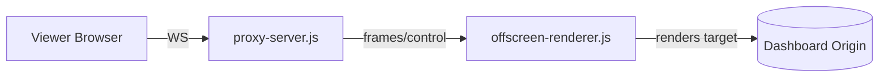

# Reverse Proxy Streamer (Remote setup)

Files: `src/main/proxy-server.js`, `src/main/offscreen-renderer.js`, `src/renderer/proxy/*`

This optional feature streams a view of the target dashboard to remote browsers using a WebSocket-only viewer.

## How it works
- proxy-server.js hosts an HTTP/WS server.
- offscreen-renderer.js runs an offscreen BrowserWindow that loads the same target URL and sends rendered frames to proxy-server over an internal transport.
- renderer/proxy/index.html is the viewer that connects via WebSocket, receives frames, and displays them.



## Enable
In Settings (or config):
```json
{ "reverseProxy": true }
```
Restart the app if the server host/port or tray behavior changes.

## Using the viewer
- Open the viewer URL shown in logs or the UI (e.g., http://host:PORT/proxy/).
- Controls in the viewer let you start/stop the stream and select resolution.

## Notes and constraints
- Viewer is WS-only; no cookies or secrets are sent to the client.
- Keep the host machine on a trusted network if exposing externally; ideally put it behind a VPN or reverse proxy with auth.
- Performance depends on GPU/CPU and network; experiment with frame rate and resolution settings in the viewer.
